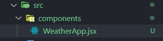
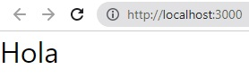

# react-02-widget-de-clima

https://www.youtube.com/watch?v=oT-feDPuJmk&t=9s

# Creamos el proyecto widget-de-clima

```
>npx create-react-app widget-de-clima
```

```
>cd widget-de-clima
```

```
npm start
```

# Creamos componente WeatherApp.jsx



```jsx
export default function WeatherApp() {
  return <div>Hola</div>;
}
```

Lo importo en App.js

```jsx
import WeatherApp from "./components/WeatherApp";

function App() {
  return <WeatherApp />;
}

export default App;
```



# OpenWeather

https://openweathermap.org/  
https://openweathermap.org/api/geocoding-api

# .env

```

```

# Inicio

Vamos a tener un formulario donde ingresamos el nombre de una ciudad.  
Le vamos a dar enter y entonces vamos hacer una solicitud http.  
Para ello necesitamos primero crear un estado.

```jsx
import { useState } from "react";

export default function WeatherApp() {
  const [weather, setWeather] = useState(null);

  return <div>Hola</div>;
}
```

# Añadimos la estructura base

Un form y un div.

```jsx
import { useState } from "react";

export default function WeatherApp() {
  const [weather, setWeather] = useState(null);

  return (
    <>
      <form action=""></form>
      <div>Info</div>
    </>
  );
}
```

# Creamos el componente WeatherForm.jsx

Vamos a definir un estado para nuestro input.

```jsx
import { useState } from "react";

export default function WeatherForm() {
  const [city, setCity] = useState("");

  return (
    <form>
      <input type="text" />
    </form>
  );
}
```

Luego creamos el evento onChange para tomar los cambios del input.  
Y actulizamos cuando el value sea !== ''.

```jsx
import { useState } from "react";

export default function WeatherForm() {
  const [city, setCity] = useState("");

  function onChange(e) {
    const value = e.taget.value;

    if (value !== "") {
      setCity(value);
    }
  }

  return (
    <form>
      <input type="text" onChange={onChange} />
    </form>
  );
}
```

Para el formulario definimos un onSubmit.
Cuando le demos enter vamos a mandar a llamar a un props como si fuera una funcion. Ese props lo llamamos onChangeCity.

```jsx
import { useState } from "react";

export default function WeatherForm({ onChangeCity }) {
  const [city, setCity] = useState("");

  function onChange(e) {
    const value = e.taget.value;

    if (value !== "") {
      setCity(value);
    }
  }

  function handleSubmit(e) {
    e.preventDefault();

    onChangeCity(city);
  }

  return (
    <form onSubmit={handleSubmit}>
      <input type="text" onChange={onChange} />
    </form>
  );
}
```

# Cambiamos el form por el componente WeatherForm.jsx

La funcion handleChangeCity() recibe la ciudad nueva del formulario.  
Regreso el valor a null para borrar la información.
Luego mando a llamar a otra función que se llama loadInfo().
En loadInfo espero una ciudad, ponemos london.
Sino epecifico nada en loadInfo() dentro de handleChangeCity(), la funcion loadInfo toma london por defecto.

```jsx
import { useState } from "react";
import WeatherForm from "./WeatherForm";

export default function WeatherApp() {
  const [weather, setWeather] = useState(null);

  function loadInfo(city = "london") {

	}

  function handleChangeCity(city) {
    setWeather(null);
    loadInfo(city);
  }

  return (
    <>
      <WeatherForm onChangeCity={handleChangeCity} />
      <div>Info</div>
    </>
  );
}
```

# Solocitud http

Ahora en loadInfo(city = 'london') hacemos la solicitud http.
Va hacer async y especificamos con un try-catch.
```jsx
async function loadInfo(city = 'london') {
  try {
      
  } catch (error) {
      
  }
}
```
Hacemos la solicitud  
```jsx
const request = await fetch();
```
Necesito llamar a las claves
```jsx
const request = await fetch(`${process.env.REACT_APP_URL}q=${city}&appid=${process.env.REACT_APP_KEY}`);
```
```jsx
import { useState } from "react";
import WeatherForm from "./WeatherForm";

export default function WeatherApp() {
  const [weather, setWeather] = useState(null);

  async function loadInfo(city = 'London') {
    try {
      // const request = await fetch(`https://api.openweathermap.org/geo/1.0/direct?q=London&appid=${process.env.REACT_APP_KEY}`);
      // const request = await fetch(`https://api.openweathermap.org/geo/1.0/direct?q=${city}&appid=${process.env.REACT_APP_KEY}`);
      const request = await fetch(`${process.env.REACT_APP_URL}q=${city}&appid=${process.env.REACT_APP_KEY}`);

      const json = await request.json();
      // Guardo el json recibido en setWeather
      setWeather(json);

      console.log(json);
    } catch (error) {
      
    }
  }

  function handleChangeCity(city) {
    setWeather(null);
    loadInfo(city);
  }

  return (
    <>
      <WeatherForm onChangeCity={handleChangeCity}/>
      <div>Info</div>
    </>
  );
}
```
# Mostrar info recibida
```jsx
return (
  <>
    <WeatherForm onChangeCity={handleChangeCity}/>
    {/* <div>{weather && weather[0].name}</div> */}
    <div>{weather && weather[0]?.name}</div>
  </>
);
```
# Con weatherapi.com
```jsx
import { useState } from "react";
import WeatherForm from "./WeatherForm";

export default function WeatherApp() {
  const [weather, setWeather] = useState(null);

  async function loadInfo(city = 'London') {
    try {
      const request = await fetch(`${process.env.REACT_APP_URL}&key=${process.env.REACT_APP_KEY}&q=${city}`);

      const json = await request.json();

      setWeather(json);

      console.log(json);
    } catch (error) {
      
    }
  }

  function handleChangeCity(city) {
    setWeather(null);
    loadInfo(city);
  }

  return (
    <>
      <WeatherForm onChangeCity={handleChangeCity}/>
      <div>{weather?.current.temp_c}</div>
    </>
  );
}
```
# useEffect
Si quiero que se cargue una ciudad por defecto cuando se inicia la aplicacion.
1.-Tenemos la posibilidad de ejecutar codigo cada vez que se carga la página o se crea un componente. 
2.-Cada vez que existe un renderizado o render de todo el estado de l aplicación.
3.-Cuando el componente se destruye
useEffect() es una funcion que espera recibir un callback, simplemente otra función.
Tiene 2 parámetros,  
1.-La función callback que va a ejecutar y el  
2do parametro es un arreglo de dependencias.
```jsx
useEffect(() => {

}, []);
```
1.-Cuando se carga la informacion, si dejo el arreglo vacio quiere decir que solo se va a ejecutar una vez, solo cuando se crea el componente.
```jsx
useEffect(() => {
    loadInfo();
}, []);
```
2.-Quiero que se ejecute cuando algun estado cambie en mi aplicación, en este caso el valor de weather
```jsx
useEffect(() => {
  document.title = `Weather | ${weather?.location.name ?? ""}`;
}, [weather]);
```